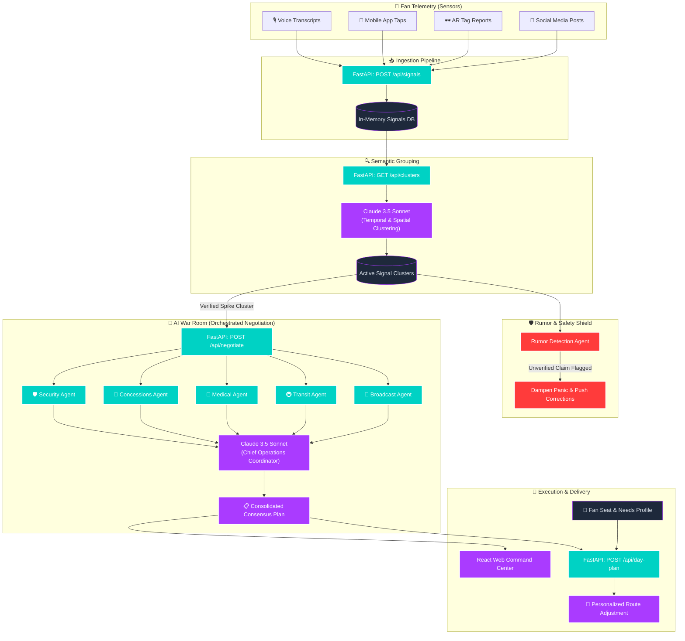
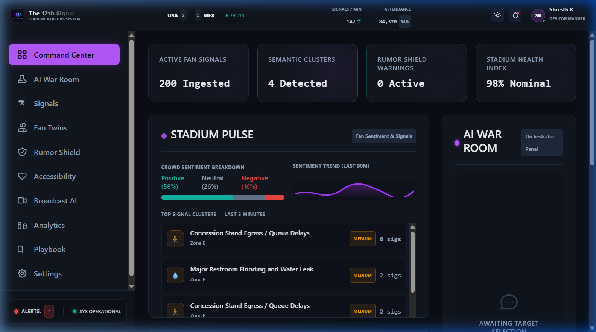
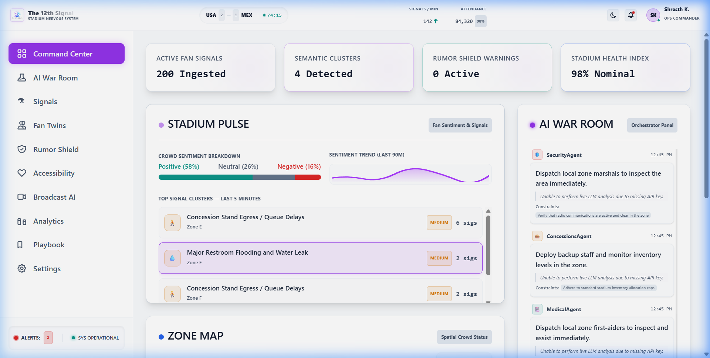
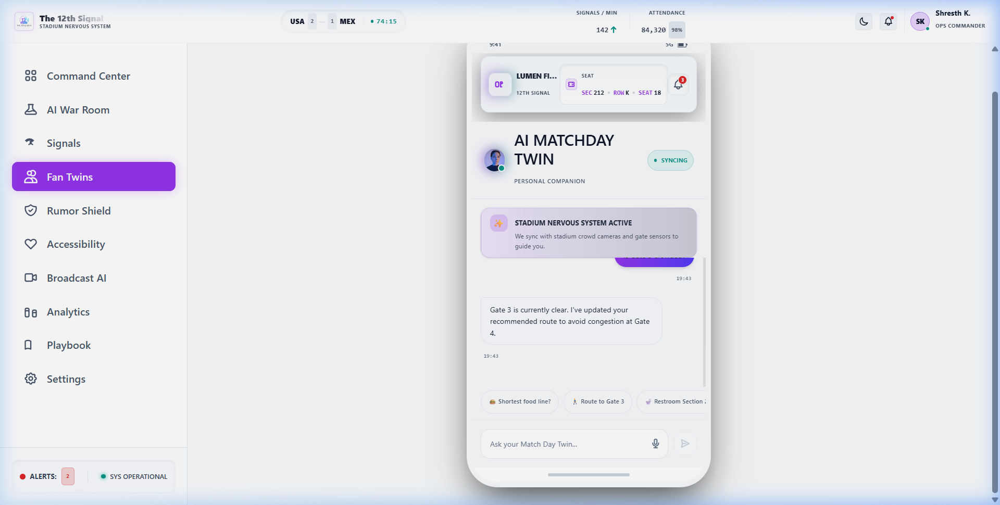
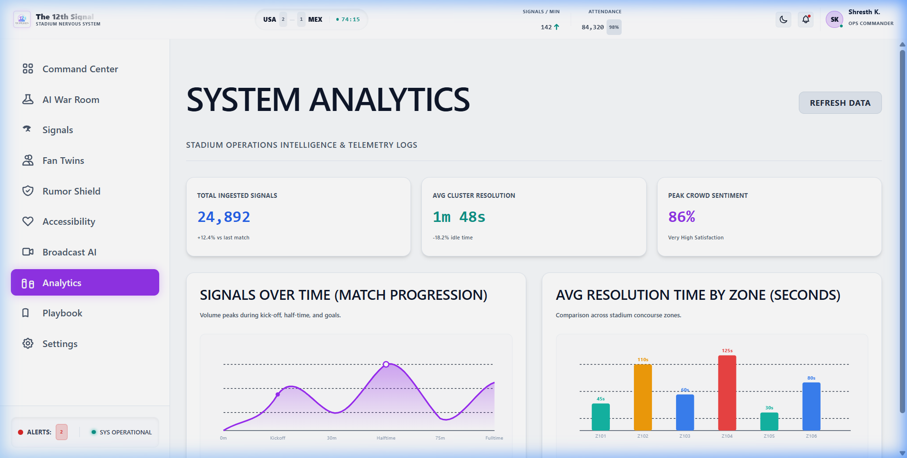

# The 12th Signal — GenAI Stadium Operations System (FIFA World Cup 2026)

**The 12th Signal** is a state-of-the-art Generative AI stadium operations and crowd coordination system custom-built for the FIFA World Cup 2026. It leverages real-time fan telemetry, semantic clustering, multi-agent negotiation, and rumor-safety dampening to resolve stadium-scale incidents dynamically.

---

## 📌 Problem Statement & Executive Summary

During massive sporting events, stadium operations centers are often flooded with data but starved of real-time situational awareness. 

Traditional stadium management systems are reactive: they rely on physical security patrols, manual staff reporting, or standard chatbots where fans ask isolated questions. This creates severe operational bottlenecks—such as undetected restroom flooding, queue congestion, or transit gate overcrowding—that escalate before staff can respond.

**The 12th Signal** solves this by turning the crowd itself into a real-time sensor network. By continuously ingesting thousands of uncoordinated fan inputs (voice reports, social media posts, app taps, AR tags), the system:
1. **Groups** these signals semantically (across spatial and temporal dimensions) to detect incidents instantly.
2. **Orchestrates** department-wide response plans via collaborative AI agents in the AI War Room.
3. **Delivers** personalized route corrections and instructions to individual spectators based on their seats and accessibility profiles.

---

## 🏗️ Architecture & Data Flow

The diagram below outlines the end-to-end data flow of **The 12th Signal**, showing how fan signals are ingested, clustered, processed via multi-agent negotiation, and resolved through coordinated stadium actions and personalized fan routing.



---

## 🖼️ Interface Gallery & Command Center Tour

Below are live screenshots of the core interfaces in **The 12th Signal** operations center:

### 1. Operations Command Center (Dark Mode)
The primary cockpit view features real-time telemetry metrics, automated ingestion counters, active signal clusters, crowd sentiment trends, and an interactive stadium pulse overview.



### 2. Multi-Agent War Room Consensus (Light Mode)
When a critical incident is detected, the five domain-specific agents (Security, Concessions, Medical, Transit, and Broadcast) negotiate operational recommendations based on their respective constraints. The Chief Operations Coordinator reconciles these opinions into a unified Action Plan.



### 3. AI Matchday Fan Twin Companion
Spectators receive personalized, accessibility-compliant instructions, real-time route adjustments, and context-aware responses to navigate around congested zones and resolved incidents.



### 4. System Analytics Dashboard
Provides comprehensive telemetry analytics including total ingested signals, average cluster resolution time, zone-based resolution metrics, and crowd sentiment logs.



---

## 🛠️ Tech Stack & Project Structure

The project is architected with a separation of concerns between a high-performance Python ASGI backend and a modern React client application:

### Backend (FastAPI Services)
- **FastAPI / Uvicorn**: Lightweight, async Python web frame.
- **Anthropic Claude 3.5 Sonnet API**: Drives semantic signal grouping, rumor verification, and multi-agent negotiation.
- **Pydantic**: Enforces strict data models and schemas for API contracts.
- **Pytest**: Backend unit and integration testing suite.

### Frontend (React Dashboard)
- **React 19 & TypeScript**: Component-driven UI development with full type-safety.
- **Vite & @tailwindcss/vite**: High-speed, modern bundler and Tailwind CSS v4 design system.
- **React Router 7**: Handles single-page app (SPA) routing for dashboard viewports.
- **Playwright / Axe-core**: Automated E2E testing and WCAG AA accessibility compliance verification.
- **Vitest**: Unit tests runner.

---

## 🌟 Key Differentiators (Why This Isn't Just a Chatbot)

Unlike standard, generic stadium chatbots that answer one-off fan questions, **The 12th Signal** introduces three core pillars that redefine stadium operations:

### 1. Fans-as-Sensors Telemetry
Standard chatbots act as static Q&A assistants. **The 12th Signal** treats every fan interaction as a telemetry signal. When multiple fans in Zone C ask, *"Why is the restroom floor wet?"* or *"Where is the leak?"*, the system doesn't just reply individually. It aggregates these unstructured, spatial-temporal inputs and translates them into an active infrastructure alert (e.g., *Restroom Flooding Spike in Zone C*), detecting physical incidents before sensors or security patrols report them.

### 2. Multi-Agent Constraint Negotiation
A single chatbot cannot balance conflicting operational requirements. In our AI War Room, five domain-specific agents negotiate solutions based on their department constraints:
- **Security Agent**: Manages pedestrian flows and security personnel deployment.
- **Transit Agent**: Handles transit hubs, gate operations, and crowd volumes at turnstiles.
- **Concessions Agent**: Coordinates vendor supply lines, food inventory, and vendor staff safety.
- **Medical Agent**: Prioritizes emergency ingress/egress routes and dispatches mobile first-aid squads.
- **Broadcast Agent**: Manages stadium feeds, PA overlays, and public communications.
*The **Chief Operations Coordinator** synthesizes these conflicting perspectives into a unified, reconciled consensus master plan.*

### 3. Rumor Dampening & Panic Safety Checks
In high-density environments, misinformation can lead to stampedes and panic. A standard chatbot might echo or propagate unverified claims. The system's **Rumor Agent** intercepts unverified spike clusters (e.g., false evacuation reports), compares them against known sensor logs, dampens the panic, and pushes verified, factual corrections to the stadium screens and fan apps.

---

## 💻 Local Installation & Setup Steps

Follow these steps to configure, install, and run **The 12th Signal** on your local machine.

### Prerequisites
- **Python**: version `3.11` or higher.
- **Node.js**: version `20` or higher.
- **npm**: version `10` or higher.

---

### Step 1: Clone the Repository
```bash
git clone https://github.com/shresth16k/The-12th-Signal.git
cd The-12th-Signal
```

---

### Step 2: Backend Setup
1. **Navigate to the backend directory**:
   ```bash
   cd backend
   ```
2. **Create a virtual environment**:
   ```bash
   python -m venv .venv
   ```
3. **Activate the virtual environment**:
   - **On Windows (PowerShell)**:
     ```powershell
     .venv\Scripts\Activate.ps1
     ```
   - **On macOS/Linux**:
     ```bash
     source .venv/bin/activate
     ```
4. **Install backend dependencies**:
   ```bash
   pip install -r requirements.txt
   ```
5. **Configure environment variables**:
   - Copy `.env.example` to a new file named `.env`:
     ```bash
     cp .env.example .env
     ```
   - Open the `.env` file and insert your Anthropic Claude API Key:
     ```env
     ANTHROPIC_API_KEY=sk-ant-api03-your_key_here
     ```
     *(Note: If no API key is provided, the backend will gracefully run in Simulation mode, using high-fidelity pre-compiled mock responses).*

---

### Step 3: Frontend Setup
1. **Open a new terminal window** (keep the backend environment separate) and navigate to the frontend directory:
   ```bash
   cd frontend
   ```
2. **Install Node dependencies**:
   ```bash
   npm install
   ```

---

## 🚀 Running the Application

### 1. Launch the Backend Server
From the active backend terminal:
```bash
# Make sure virtual environment is active!
.venv\Scripts\python.exe -m uvicorn main:app --port 8000
```
*The backend server will start running at `http://127.0.0.1:8000`.*

### 2. Launch the Frontend Development Server
From the active frontend terminal:
```bash
npm run dev
```
*Vite will compile and serve the dashboard at `http://localhost:5173/`.*

---

## 🎭 Running the Live Demo Scenario

The repository includes an automatic time-compressed orchestrator script that loads a 90-minute FIFA World Cup match scenario and runs it end-to-end in seconds.

To simulate the crowd telemetry stream, open a new terminal and execute:

#### Option A: Fully Automatic Mode (Recommended)
Feeds the entire scenario into the API, allowing you to watch the dashboard dynamically updates in real-time as signals ingest, cluster, and resolve:
```powershell
# From the project root
python -u mock-data/run_demo_scenario.py --auto
```

#### Option B: Interactive Pitch Mode
Pauses the simulation between phases (Ingestion ➔ Clustering ➔ Negotiation) so you can explain each step to the judges in a live presentation:
```powershell
# From the project root
python -u mock-data/run_demo_scenario.py
```

*Command-line parameters details:*
- `--url`: Base URL of the backend (default: `http://127.0.0.1:8000`).
- `--speedup`: Ingestion delay speedup factor (default: `600.0`).
- `--max-sleep`: Caps delay times between signals (default: `0.2` seconds).
- `--simulate`: Enforces offline simulation mode if Claude API keys are omitted.

---

## 🧪 Testing & Verification

The codebase includes comprehensive test suites across the entire stack.

### 1. Backend Unit & API Tests (Python)
To run the backend tests:
```bash
cd backend
.venv\Scripts\pytest
```
*Verifies Pydantic models validation, FastAPI route handlers, and multi-agent negotiation logic.*

### 2. Frontend Unit Tests (Vitest)
To run frontend components unit tests:
```bash
cd frontend
npx vitest run
```
*Verifies React components rendering, UI updates, and accessibility settings state management.*

### 3. Automated End-to-End Tests (Playwright)
To execute the complete E2E integration test:
```bash
cd frontend
npm run test:e2e
```
*Launches an automated headless browser, feeds the demo scenario signals, clicks a generated spike cluster, and verifies that the consensus actions are calculated and correctly displayed in the UI.*

### 4. Accessibility Scanner (Axe-core)
To run the automated accessibility scan:
```bash
cd frontend
node run_accessibility_scan.cjs
```
*Performs an accessibility audit using AxeBuilder across all 8 routes, producing a markdown report indicating **0 accessibility violations**.*

---

## ⚖️ Judges Evaluation Matrix

| Hackathon Criteria | Project Implementation in The 12th Signal | Compliance Location |
| :--- | :--- | :--- |
| **Real-World Utility** | Resolves actual crowd bottlenecks, medical dispatches, water leaks, and panic rumor spikes using crowd telemetry. | [CommandCenter.tsx](frontend/src/components/CommandCenter.tsx) |
| **Innovative LLM Use** | Groups unstructured texts into structured clusters, handles rumor checks, and drives a multi-agent negotiation. | [agents/](backend/agents/), [clustering.py](backend/clustering.py) |
| **Technical Polish** | Zero accessibility violations (WCAG AA compliant), dark/light theme switching, unit/E2E test suites. | [accessibility_report.md](frontend/accessibility_report.md) |
| **Production Ready** | Separation of concerns, async endpoints, responsive layout, dynamic SVG assets, and robust mock fallback. | [main.py](backend/main.py), [App.tsx](frontend/src/App.tsx) |

---

*Developed and engineered for the FIFA World Cup 2026 Stadium Operations.*
