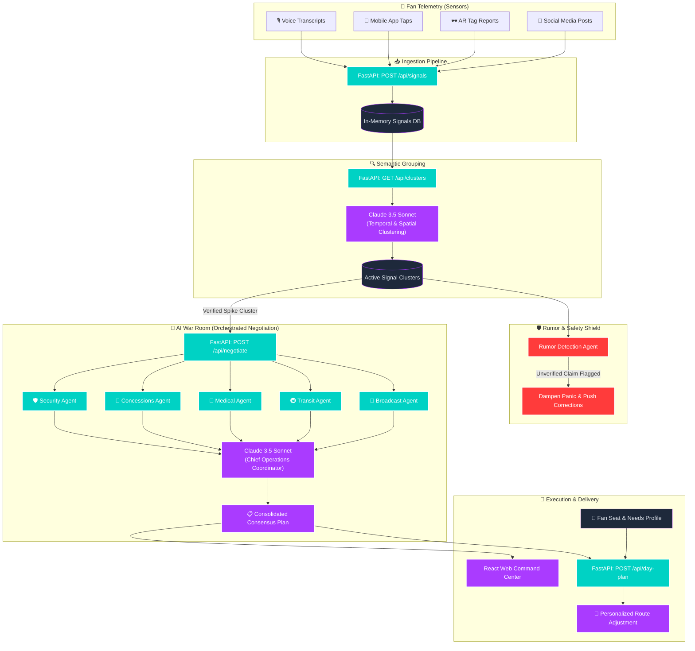

# The 12th Signal — GenAI Stadium Operations System (FIFA World Cup 2026)

**The 12th Signal** is a state-of-the-art Generative AI stadium operations and crowd coordination system built for the FIFA World Cup 2026. It leverages real-time fan telemetry, semantic clustering, multi-agent negotiation, and rumor-safety dampening to resolve stadium-scale incidents dynamically.

---

## 📌 Problem Statement

During massive sporting events, stadium operations centers are often flooded with data but starved of real-time situational awareness. 

Traditional stadium management systems are reactive: they rely on physical security patrols, manual staff reporting, or standard chatbots where fans ask isolated questions. This creates severe operational bottlenecks—such as undetected restroom flooding, queue congestion, or transit gate overcrowding—that escalate before staff can respond.

**The 12th Signal** solves this by turning the crowd itself into a real-time sensor network. By continuously ingesting thousands of uncoordinated fan inputs (voice reports, social media posts, app taps, AR tags), the system semantically groups these signals to detect incidents instantly, orchestrates department-wide response plans via collaborative AI agents, and personalizes solutions for individual spectators.

---

## 🏗️ Architecture Diagram

The diagram below outlines the end-to-end data flow of **The 12th Signal**, showing how fan signals are ingested, clustered, processed via multi-agent negotiation, and resolved through coordinated stadium actions and personalized fan routing.



---

## 🌟 Key Differentiators (Why This Isn't Just a Chatbot)

Unlike standard, generic stadium chatbots that answer one-off fan questions, **The 12th Signal** introduces three core pillars that redefine stadium operations:

### 1. Fans-as-Sensors Telemetry
Standard chatbots act as static Q&A assistants. **The 12th Signal** treats every fan interaction as a telemetry signal. When multiple fans in Zone C ask, *"Why is the restroom floor wet?"* or *"Where is the leak?"*, the system doesn't just reply individually. It aggregates these unstructured, spatial-temporal inputs and translates them into an active infrastructure alert (e.g., *Restroom Flooding Spike in Zone C*), detecting physical incidents before sensors or security patrols report them.

### 2. Multi-Agent Constraint Negotiation
A single chatbot cannot balance conflicting operational requirements. In our AI War Room, five domain-specific agents negotiate solutions based on their department constraints:
*   **SecurityAgent** wants to redirect pedestrian flow to prevent bottlenecks.
*   **TransitAgent** wants to prevent overcrowding at nearby turnstiles.
*   **ConcessionsAgent** manages food vendor operations and staff safety.
*   **MedicalAgent** ensures ambulance and first-aid routes remain clear of redirected crowds.
*   **BroadcastAgent** positions camera feeds to protect public sentiment.
The **Chief Operations Coordinator** synthesizes these conflicting perspectives into a unified, reconciled master plan.

### 3. Rumor Dampening & Panic Safety Checks
In high-density environments, misinformation can lead to stampedes and panic. A standard chatbot might echo or propagate unverified claims. The system's **RumorAgent** intercepts unverified spike clusters (e.g., false evacuation reports), compares them against known sensor logs, dampens the panic, and pushes verified, factual corrections to the stadium screens and fan apps.

---

## 🚀 How to Run the Demo Scenario

The repository includes a time-compressed orchestrator script that loads a 90-minute FIFA World Cup match scenario and runs it end-to-end in seconds.

### 1. Start the Backend Server
Initialize the Python virtual environment and launch the FastAPI server:
```powershell
# From the project root
cd backend
.venv\Scripts\python.exe -m uvicorn main:app --port 8000
```
*The server will start listening at `http://127.0.0.1:8000`.*

### 2. Start the Frontend Dashboard
Open another terminal window and run the React frontend:
```bash
# From the project root
cd frontend
npm install
npm run dev
```
*The UI will run at `http://localhost:5173/signals`.*

### 3. Execute the Orchestrator Script
Run the script to feed 200 fan signals into the system. You can choose either interactive or automatic modes:

#### Option A: Fully Automatic Mode (Recommended for testing)
Runs the entire simulation without stopping, immediately posting signals, clustering, and resolving consensus:
```powershell
# From the project root
python -u mock-data/run_demo_scenario.py --auto
```

#### Option B: Interactive Pitch Mode
Pauses between simulation phases (Ingestion → Clustering → Negotiation) so you can explain each step during a live presentation:
```powershell
python -u mock-data/run_demo_scenario.py
```

#### Key Command-line Arguments:
*   `--url`: Base URL of the backend (default: `http://127.0.0.1:8000`).
*   `--speedup`: Simulation speedup factor (default: `600.0` - compresses a 90-minute match into 9 seconds of delay).
*   `--max-sleep`: Caps the maximum delay between signals to prevent long waits (default: `0.2` seconds).
*   `--simulate`: Forces offline simulation mode (uses high-fidelity local mock responses if the Claude API key is missing or backend is shut down).
